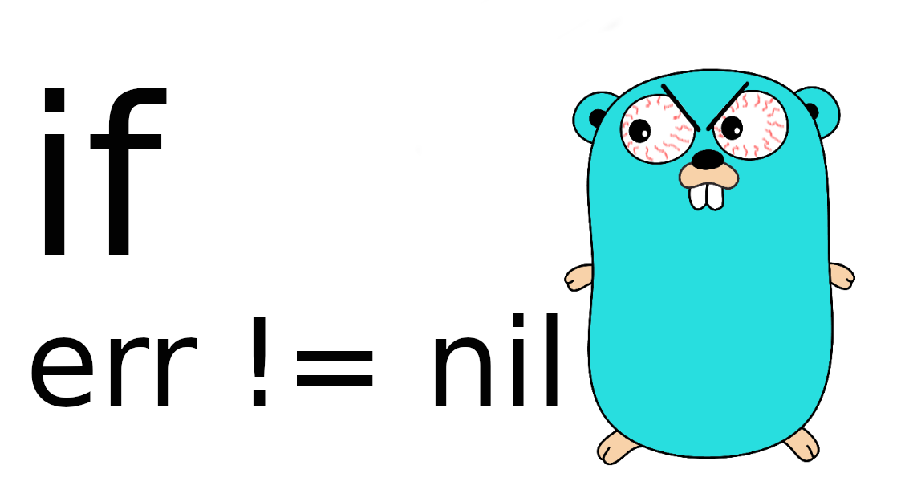

Я довольно долго хейтил Go, за его неприглядный синтаксис. И, как это обычно и бывает, совсем скоро начну на нем работать. Вся статья - одно большое ИМХО на обработку ошибок в Go. Я не большой специалист в этом языке, но понять что что-то выглядит плохо, способен каждый.

Статья не претендует на звание "полезной" и даже "умной". Читайте её как чьё-то мнение, на определенные особенности языка.

## Одно большое ИМХО
Когда пишешь код на Go, ощущение, будто ты пишешь один и тот же код, ведь каждый вызов функции сопровождает эта странная обработка ошибки `err != nil`. Если раньше, до дженериков, это можно было оправдывать, то сейчас подобное тянется скорее как легаси. И ладно если бы это критиковалось, но ведь Go-внари (программисты использующие язык программирования Go) яро отстаивают подобное, не видя проблем и даже называя это "фичей" языка. (Тогда фича JS - прокачка экстрасенсорных способностей, от попыток угадать что у тебя в переменной `test2`)

Мало того, что контракт *если `err == nil`, то ошибки нет* довольно жидкий, так ещё и постоянно проверять результат на ошибки при вызове лишь усложняет логику обработки этих ошибок. У нас нет особо вариантов, кроме как прервать выполнение функции и отдать ошибку.

По началу я думал, что Go-внари получают ЗП построчно, потому так отстаивают подобную обработку, что бы всё объяснило. Но им платят как и всем, из чего следует вывод - Go-внари любят страдать.

## ИМХО выраженное через код
Так как мне придется пользоваться данной технологией, я решил сделать для себя, в качестве эксперимента, библиотеку, которая бы позволяла изменить подход в обработке ошибок. Потратил на это около часа.

Так как мне нравится обработка ошибок в Rust, я решил позаимствовать подход, создав структуру, которая имеет два поля - ошибку и значение. Сразу добавил методы взаимодействия с этой структурой и получил вполне терпимый результат, который смог добавить в свой проект. [Ссылка на библиотеку.](https://github.com/LimitR/goresult)

Всё что я решил сделать, так это создать обертку вокруг результата вызова функции, чтоб работать с одной структурой `Result[T]`, которая имеет значение, и/или ошибку. Такой подход используется в Rust, но вместо struct используется enum. Но работаем с тем что имеем.

Вместо того, чтоб каждый раз провериять ошибку:

```go
file, err := os.Open("/path/to/file.txt")
if err != nil {
    log.Fatal(err)
}
defer file.Close()
```
Мы можем вызвать панику, или использовать прочую логику:

```go
file := goresult.CreateResult(os.Open("/path/to/file.txt")).Unwrap()
defer file.Close()
```
Такой подход позволяет сохранить единообразие данных, возвращаемых из функций и упростить (скорее избавить от бесконечных проверок) обработку ошибок. Ведь теперь любая функция может вернуть `Result[T]`, у которой можно вызвать нужный метод обработки, или не обрабатывать вовсе, если это не требуется в данный момент.

Если нам в момент вызова возвращается ошибка, но вместо паники мы хотим изменить поведение (значение результата), то это делается самым очевидным образом:

```go
result := getResultError().UnwrapOrOn(func(res error) string {
	fmt.Println(res.Error()) // Error message
	return "default"
})
fmt.Println(result) // default
```
Или:
```go
result := getResultError().UnwrapOrElse("default")
fmt.Println(result) // default
```
Вместо:
```go
result, err := getResultError()
if err != nil {
    result = "default"
}
fmt.Println(result) // default
```

Такой подход более гибкий к обработке к ошибок и позволяет создать одну обработку на всю программу, вместо бесконечного повторения одинокового кода.

## ИМ ХОрошо и так

Сколько вы бы не пытались доказать свою дочку зрения, касаемо странного решения при проектировании языка, некоторые люди не видят причин к изменениям, ведь подобное не только вызывает стресс, так ещё и выглядит как покушение на тебя лично. Ведь как кто-то посмел усомниться в подходе, к которому я привык. Очевидно что этот человек просто глупый и хочет усложнить себе жизнь.

Но я не пытаюсь убедить кого-то, что мой подход лучше. Это скорее трезвый взгляд человека, которого что-то смущает в технологии. Возможно у меня не замыленный взгляд, а что скорее всего - я просто чего-то не понял. В любом случае мне было бы очень интересно выслушать ваше мнение, а любую критику реализации, принимаю в виде пулреквестов. Всем мира, добра и `err != nil`!